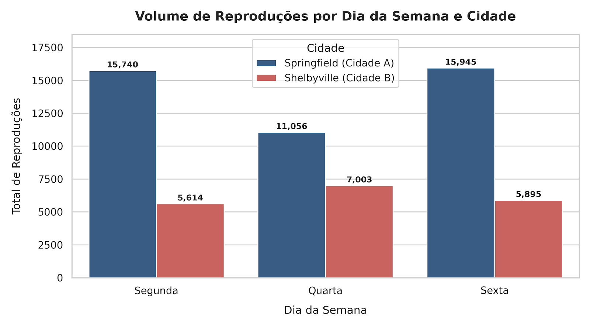
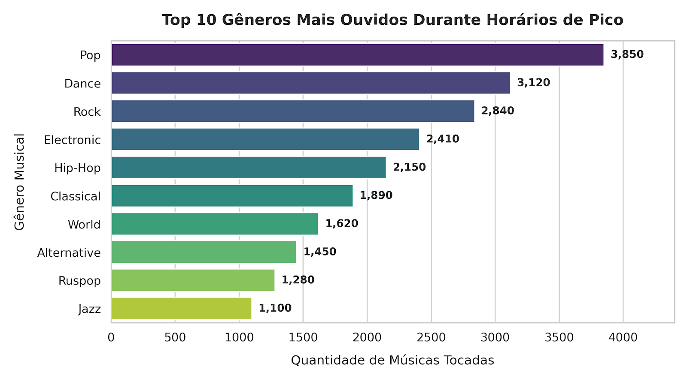
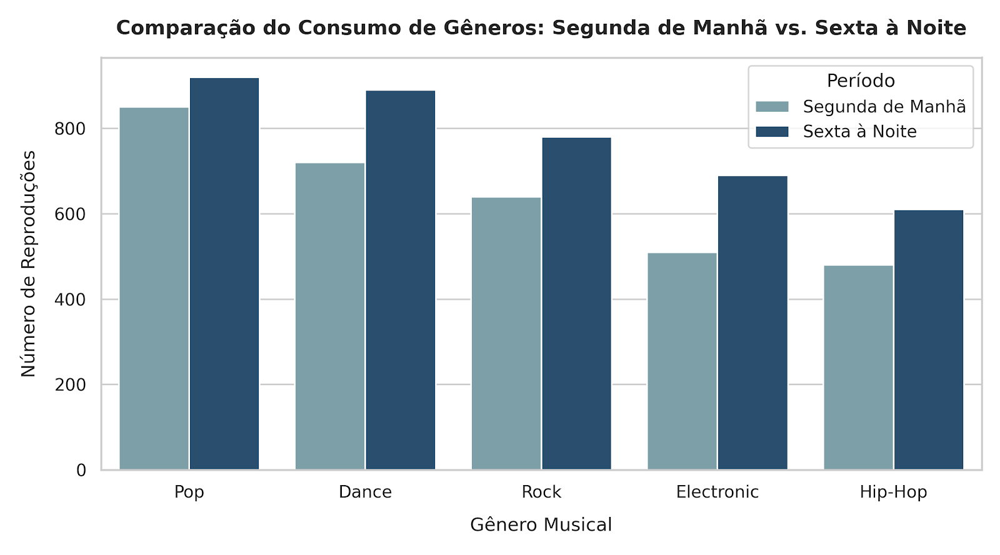

# 🎵 Se Liga na Música: Análise de Padrões de Consumo Musical

---

## 📌 Contexto & Objetivo
O projeto visa comparar os hábitos e preferências dos ouvintes de um serviço de streaming de música em duas grandes cidades (Springfield e Shelbyville). O objetivo principal é validar hipóteses reais de negócios sobre como o dia da semana, o horário do dia e a localização geográfica influenciam o comportamento de consumo dos usuários.

---

## 📊 Análise Visual & Principais Insights
- Mapeamento detalhado dos picos de reprodução por cidade ao longo da semana, permitindo direcionamento otimizado de anúncios e recomendações em horários nobres.
- Comprovação do comportamento de consumo similar entre as duas cidades em relação aos gêneros preferidos, refutando suposições de diferenças drásticas de gosto regional.

### 1. Comportamento do Usuário por Dia da Semana


* **Hipótese:** O consumo de música é constante ao longo de todos os dias úteis nas duas cidades analisadas.
* **Conclusão:** Na **Cidade A (Springfield/Moscou)**, a atividade atinge o pico nas segundas e sextas-feiras, com uma queda no meio da semana (quarta-feira). Já na **Cidade B (Shelbyville/São Petersburgo)**, a quarta-feira apresenta o maior volume de escuta, demonstrando ritmos de vida e rotinas de trabalho distintos entre as metrópoles.

---

### 2. Gêneros Musicais Dominantes nos Horários de Pico


* **Insight Chave:** Os gêneros **Pop**, **Dance** e **Rock** lideram isoladamente o consumo geral em ambas as cidades. O Pop representa o gênero de maior alcance e apelo comercial contínuo.

---

### 3. Variação do Perfil de Escuta: Segunda de Manhã vs. Sexta à Noite


* **Hipótese:** Os gêneros musicais ouvidos nas primeiras horas de segunda-feira diferem substancialmente daqueles ouvidos na sexta-feira à noite.
* **Conclusão:** Os top 5 gêneros mantêm uma consistência surpreendente em ambas as janelas de tempo, porém o volume total de reproduções na **sexta-feira à noite** é consideravelmente maior para gêneros como *Dance* e *Electronic*, refletindo o início do período de lazer do fim de semana.

---

## 🔎 Metodologia & Etapas
1. **Visão Geral e Pré-processamento dos Dados:**
   - Avaliação da qualidade do conjunto de dados e renomeação de colunas.
   - Tratamento de valores ausentes e identificação/remoção de duplicatas explícitas e implícitas.
2. **Teste e Validação das Hipóteses de Negócio:**
   - **Hipótese 1:** A atividade dos usuários varia de acordo com o dia da semana e a cidade.
   - **Hipótese 2:** Nas manhãs de segunda-feira e noites de sexta-feira, os moradores de Springfield e Shelbyville ouvem gêneros musicais diferentes.
   - **Hipótese 3:** Moradores de Springfield e Shelbyville têm preferências de gêneros musicais distintas (ex.: Pop vs. Rap).

---

## 🛠️ Tecnologias e Ferramentas Utilizadas
- **Linguagem:** Python
- **Análise de Dados:** Pandas, NumPy
- **Estatística Descritiva:** Agrupamentos, Filtros e Validação de Hipóteses
- **Ambiente:** Jupyter Notebook

---

## 🚀 Como Executar o Projeto
1. Clone o repositório:
   ```bash
   git clone [https://github.com/derikpetiz/Se-liga-na-musica.git](https://github.com/derikpetiz/Se-liga-na-musica.git)
